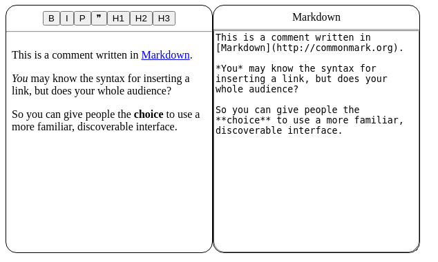

# prosemirror-md-react-ts

Prosemirror React Typescript with functional components and hooks example for initalizing and persisting editor content wth markdown text

### Style Menu
A custom react element that receives an editorView and applies toogle commands for elements specified in the mardown schema

### Prosemirror plugins
1. Keymap: for some basic commands commands
2. History: for commands of undo and redo

start with command : `vite start`
